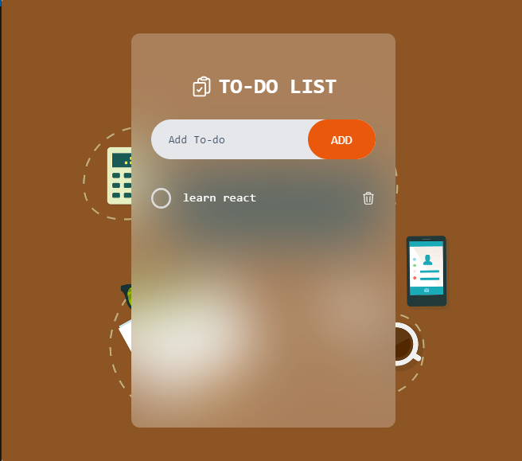
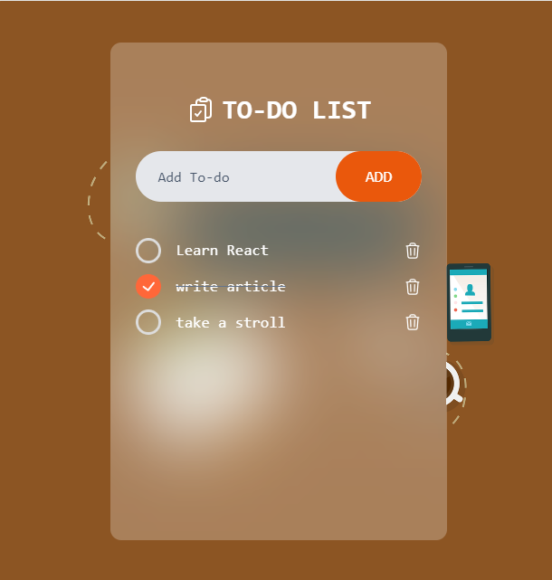

# To-Do List App

## Overview

This project is part of the Codevixens 10 Days of Frontend Challenge (Day 7). This To-Do List application was built using Vite React and styled with TailwindCSS. The task focuses on mastering  state management, event handling, and list rendering in ReactJS.

## Features

- **State Management:** React's **useState**  hook were used to manage input value and list of to-do items.
- **Event Handling:** Handles the add button to add new todo item.
- **User Interface:** Simple UI that dislays new to-do and completed to-do tasks.

## Installation

1. Clone the repository: ```javascript git clone https://github.com/Nkwor-Jane/todo-list.git```

2. Navigate to the project directory: ```javascript cd todo-list```

3. Install dependencies:```javascript npm install```

## Usage

1. Start the development server: ```javascript npm run dev```

2. Open your browser and navigate to: ```javascript http://localhost:5173/```

## How it Works

1. **Input Fields:** Enter the new To-do item.
2. **Add Button:** Click **ADD** button to add new To-DO item.
3. **Display:** To-Do list items are displayed. To-Do list items can also be crossed out and deleted.

## Screenshots

- Before input
  


- After input


## Live Demo

Check out the live demo [here](https://todo-list-delta-eight-35.vercel.app/).

## Contirbuting

Feel free to clone and fork this repository. You can also submit pull requests. Any contributions are welcome!

## License

This project is licensed under the MIT License

## Acknowledgements

- [Codevixens](https://codevixens.org/) for organizing this challenge.
- Lois Bassey, Chinaza Igboanugo, Gaelle Tiku Brenda - and Oyakinsola Shoroye for their contributions and guidance towards the successful completion of this projects.

Feel free to customize it further to fit your needs! If you have any specific details you'd like to add or change, let me know.
